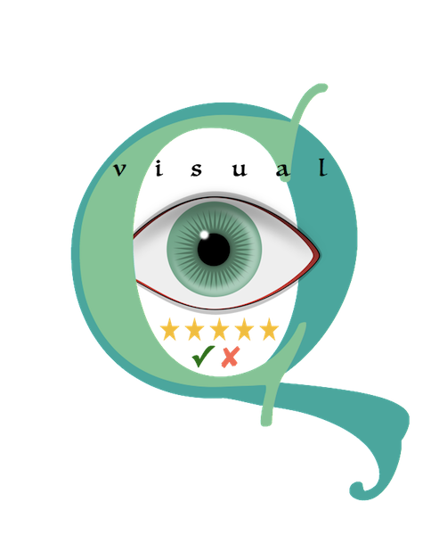

.. image:: https://zenodo.org/badge/105958496.svg
   :target: https://zenodo.org/badge/latestdoi/105958496

.. image:: https://img.shields.io/pypi/v/visualqc.svg
        :target: https://pypi.python.org/pypi/visualqc

.. image:: https://api.codacy.com/project/badge/Grade/2da8c2b4dbcd433eb4943eb52f0b00d6
        :target: https://www.codacy.com/app/raamana/visualqc?utm_source=github.com&amp;utm_medium=referral&amp;utm_content=raamana/visualqc&amp;utm_campaign=Badge_Grade

.. image:: https://img.shields.io/badge/say-thanks-ff69b4.svg
        :target: https://saythanks.io/to/raamana

==========================================================================================
VisualQC : Assistive tool to ease the quality control workflow of neuroimaging data
==========================================================================================

---

.. image:: docs/visualqc_poster_comprehensive.png

Note: VisualQC employs `release early and release often mechanism <https://en.wikipedia.org/wiki/Release_early,_release_often>`_ to seek user feedback and for thorough testing. Hence you might find some rough edges in docs or examples - please let us know if you do.

* Software Documentation: https://raamana.github.io/visualqc
* `User Manual </docs/VisualQC_TrainingManual_v1p4.pdf>`_
* Free software: Apache 2.0 license
* Pure python package (no licensing issues ala matlab, easy to install and update requiring no other external installations or maintenance)
* Generic design for API that can be adapted for other domains, imaging or medical or otherwise.

Galleries
----------

 * NEW: `Defacing QC <https://raamana.github.io/visualqc/gallery_defacing.html>`_
 * `Freesurfer <https://raamana.github.io/visualqc/gallery_freesurfer.html>`_
 * `Functional MRI <https://raamana.github.io/visualqc/gallery_functional_mri.html>`_
 * `Registration/Alignment quality <https://raamana.github.io/visualqc/gallery_registration_unimodal.html>`_
 * `Structural T1w MRI <https://raamana.github.io/visualqc/gallery_t1_mri.html>`_
 * `Volumetric Segmentation <https://raamana.github.io/visualqc/gallery_segmentation_volumetric.html>`_

Contributions
--------------

`Contributions are welcome. <CONTRIBUTING.rst>`_

Citation
--------------

`Citation details are here <docs/citation.rst>`_

---

.. image:: https://img.shields.io/badge/say-thanks-ff69b4.svg
        :target: https://saythanks.io/to/raamana

