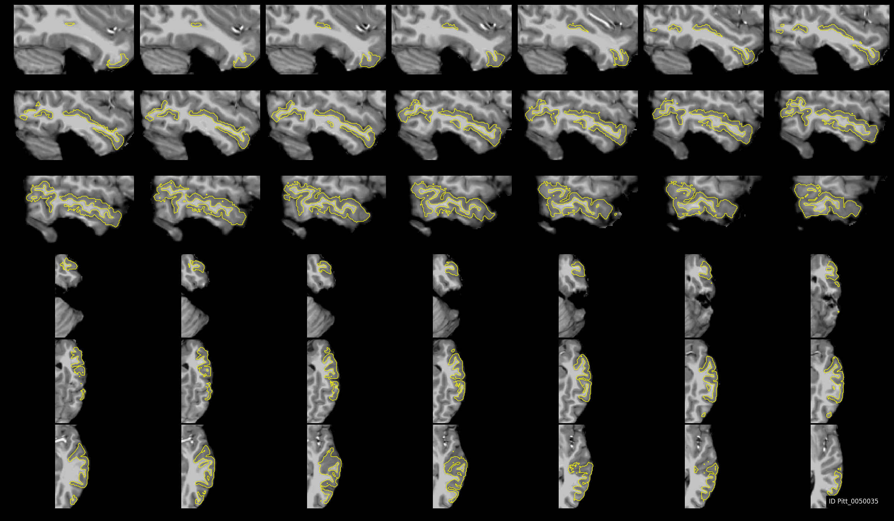

Gallery - Freesurfer Parcellation
----------------------------------

Some examples of how the interface looks are shown below. The first screenshot showcases the use case wherein we can review the accuracy of Freesufer's cortical parcellation against the original MRI (note that only one view is shown and one panel is zoomed-in):

.. image:: vis/fs_contour/visual_qc_cortical_contour__Pitt_0050034_v1_ns18_4x6.png

In this screenshot, we show the user interface showing the elements to rating, notes and alerts from outlier detection module:

.. image:: vis/fs_contour/new_ui_with_outlier_alert_notes.png

In the screenshot below, we show the use case for a single label (subcortical segmentation, tissue class or cortical ROI) - shown here are hippocampus and amygdala:

.. image:: vis/fs_contour/visual_qc_labels_contour_53_Pitt_0050039_v012_ns18_9x6.png

We can also add nearby amygdala:

.. image:: vis/fs_contour/visual_qc_labels_contour_53_54_Pitt_0050036_v02_ns21_6x7.png

And you can add as many ROIs as you like:

.. image:: vis/fs_contour/visual_qc_labels_contour_10_11_12_13_NYU_0051036.png

ROIs could be from anywhere in the MRI (including big cortical labels too!). For example, let's look at Insula (label 1035 in Freesurfer ColorLUT) in the left hemi-sphere :

.. image:: vis/fs_contour/visual_qc_labels_contour_1035_Pitt_0050032_v02_ns21_6x7.png

And, how about middle temporal?

Let's just focus on axial view to get more detail:

.. image:: vis/fs_contour/visual_qc_labels_contour_2015_Pitt_0050039_v2_ns27_3x9.png

Fore more visualizations e.g. those with filled labels instead of contours, refer to :doc:`gallery_freesurfer_filled`.
