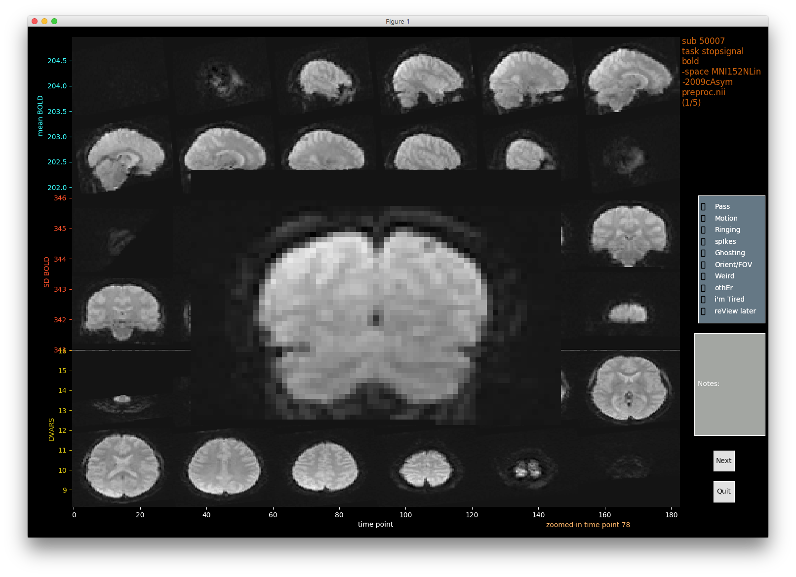
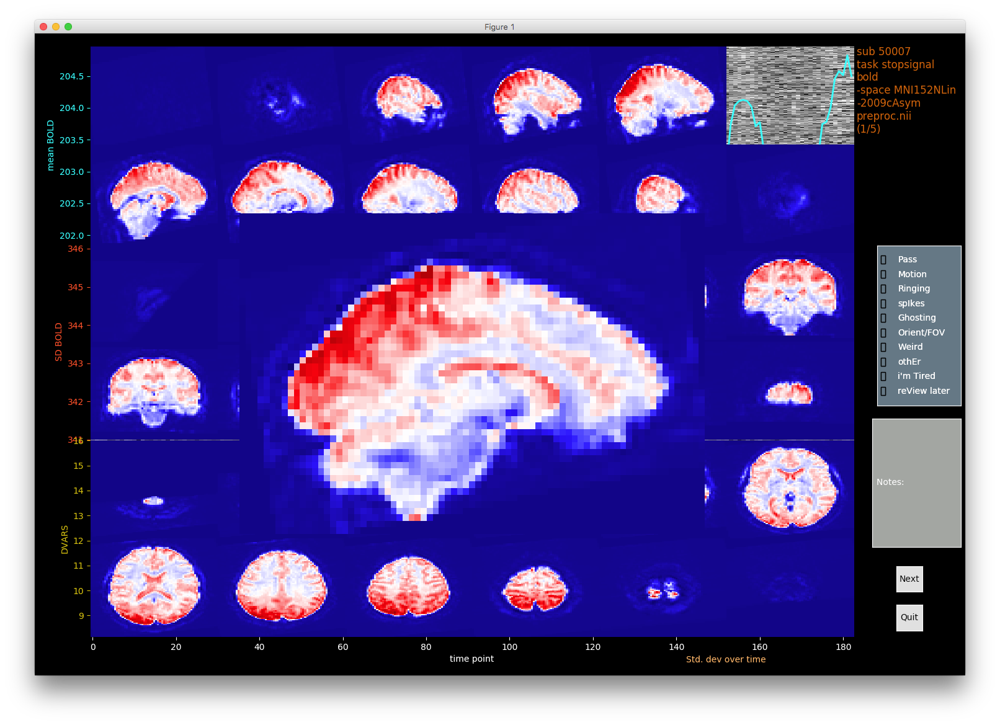
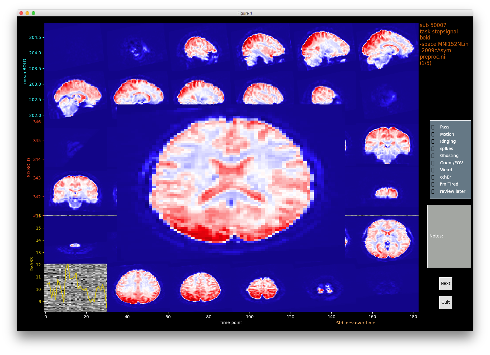
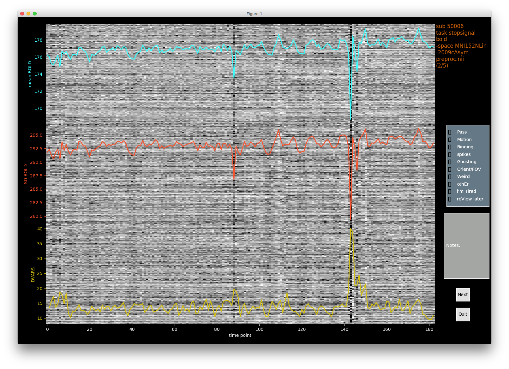
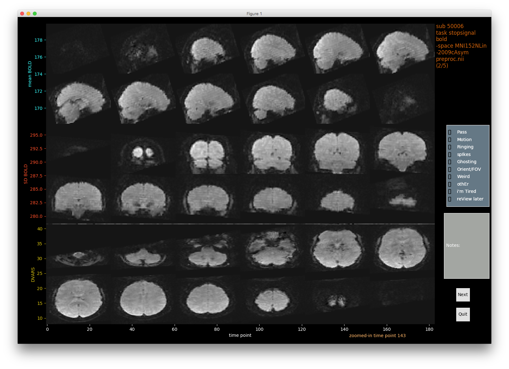
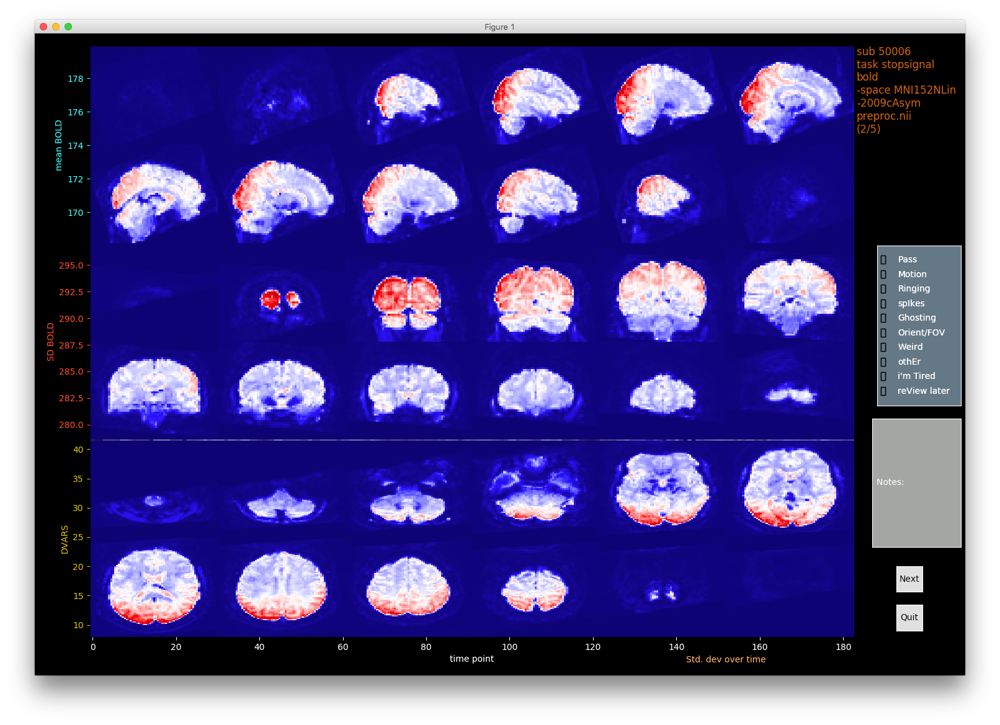

Gallery - Functional MRI scan - artefact detection and rating
--------------------------------------------------------------

**This is an early preview of an app in active development - your feedback to improve will be greatly appreciated `here <https://github.com/raamana/visualqc/issues/new>`_.**

The carpet plot [1]_ can easily reveal abnormal frames (time-points) to the human eye, which is what VisualQC starts with for functional MRI scans - see below. VisualQC also overlay few useful statistics for each frame to further help you decide on the quality of that frame. We currently show 3 stats (mean, SD, and DVARS, but plan to few more such as framewise displacement (FD) and other motion parameters. Your suggestions and contributions are very `welcome <https://github.com/raamana/visualqc/issues/new>`_.

.. image:: vis/func_mri/func_mri1.png

However, you may wish to dig into these "interesting" frames further to get a full view, so you can see what is going on in that frame - simply right click on any vertical line and VisualQC presents a full view of that frame in different views:

.. image:: vis/func_mri/func_mri2.png

Given the focus of VisualQC and purpose of quality control, we need to be able to examine every detail before ruling out or rating any artefacts, so you can right click again on any slice to zoom it further to reveal all the voxels:

You can do that on any other slice as well:

.. image:: vis/func_mri/func_mri4.png

A common way to inspect an fMRI run is to visualize the SD map (std. dev of a BOLD signal at each voxel over time), which can be commanded anytime with a simple keyboard shortcut ``alt+s``:

.. image:: vis/func_mri/func_mri5.png

You can already guess you can zoom in any of these slices too! :). btw, do you have any suggestions for a better colormap for SD maps? Check this `list <https://matplotlib.org/tutorials/colors/colormaps.html>`_ and let me know.

You can easily get back to the home screen with single clicks, and once you are done click ``Next`` button to retrieve the next run:

.. image:: vis/func_mri/func_mri8.png

which is shown here, with atleast two "interesting" and likely bad frames:

And then, you can repeat the aforementioned process to thoroughly QC this run, without worrying about opening and closing and resizing multiple viewers and spreadsheets:

.. [1]  Power, J. D. (2017). A simple but useful way to assess fMRI scan qualities. NeuroImage, 154, 150–158. http://doi.org/10.1016/j.neuroimage.2016.08.009
